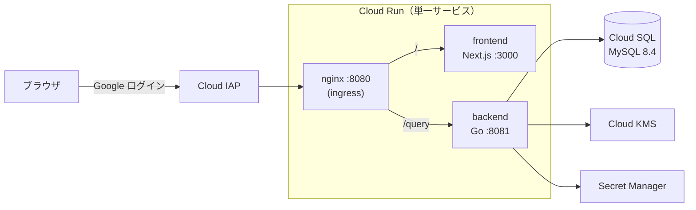

# KKB

セルフホスト志向の、複式簿記ベースの家計簿アプリ。自分専用のシングルユーザー構成で、Google Cloud 上で運用中。

[English README is here](./README.md)

## 開発の動機

もともと Notion のテンプレートで家計簿をつけていましたが、Notion 上に擬似的な RDB を構築する仕組みのため、データが増えるほど動作が重くなりました。既存の家計簿アプリも選択肢になりませんでした。UI が固定されていて、自分が一番見たい数字を一番見やすい場所に置けないためです。

コードを書けるのだから、実際の RDB を使い、UI も自分で作れば両方の課題を根本から解決できる——これが開発のきっかけです。ダッシュボードでは今週・今月・今年の支出を最初に表示し、スマートフォンでは最上部に配置しています。支出を常に見えるようにすることが、このアプリの目的そのものだからです。

## アーキテクチャ



| レイヤー | 技術 |
|---|---|
| バックエンド | Go, gqlgen, ent (ORM), Atlas (マイグレーション) |
| フロントエンド | TypeScript, Next.js, React, Apollo Client |
| API | GraphQL (+ GraphQL Codegen) |
| DB | MySQL 8.4 (Cloud SQL) |
| クラウド | GCP — Cloud Run, Cloud SQL, KMS, Secret Manager, IAP |
| IaC | Terraform |
| CI | GitHub Actions (lint, test) |

### リポジトリ構成

| パス | 内容 |
|---|---|
| `go/` | バックエンド — gqlgen リゾルバ、ent スキーマ、internal パッケージ群（`aggregation`, `encryption`, `ledger_account`, `transaction`, `dataloader`, `serverenv` など） |
| `ts/` | フロントエンド — Next.js アプリ |
| `schema/` | バックエンドとフロントエンドの codegen が共有する GraphQL スキーマ |
| `containers/` | Dockerfile 群と nginx ingress の設定 |
| `db/` | ローカル MySQL（Docker）関連ファイル |

インフラは Terraform で定義し、別のプライベートリポジトリで管理しています。

## 設計判断の記録

なぜ今の形になっているのか——採用しなかった選択肢も含めて記録します。

### なぜ複式簿記か

単純な収支簿では、実際のお金の流れを正確に表現できません。交通 IC カードへのチャージは支出ではなく資産間の移動です。クレジットカードでの支払いはまず負債が発生し、支出の確定は後になります。複式簿記なら、これらすべてを単一の仕組みで表現できます。

| エンティティ | 役割 |
|---|---|
| `LedgerAccount` | 勘定科目 — 資産・負債・収益・費用 |
| `Transaction` | 取引ヘッダー — 日付、メモ |
| `JournalEntry` | 仕訳明細 — 借方/貸方、金額 |
| `LedgerEncryptionKey` | 期間ごとのデータ暗号化キー（[暗号化](#時間ベース-dek-によるエンベロープ暗号化) 参照） |

利用にあたって簿記の知識は不要です。支出・収入・資産移動それぞれの専用入力画面が、仕訳を自動生成します。

### なぜ GraphQL か

画面構成を自由に組み替えたい——既存アプリへの不満そのものが理由です。GraphQL ではデータの形をクライアント側が決めるため、UI 変更のほとんどはフロントエンドの修正だけで完結します。サーバー側は gqlgen（スキーマファースト・コード生成）、クライアント側は Apollo Client + GraphQL Codegen で、単一のスキーマから両端の型安全性を確保しています。

### なぜ MySQL か

ワークロードはシングルユーザーによる単純な CRUD で、複雑な分析クエリも高い同時並行性も不要です。シンプルで高速な MySQL で必要十分であり、PostgreSQL の豊富な機能群に使い道がありませんでした。

### なぜ ent（と Atlas）か

- **sqlc** は不採用。クエリが静的にコンパイルされるため、実行時にフィルタや条件を組み立てる動的な SQL 生成に対応できません。
- **GORM** は型安全性の弱さから不採用。
- **ent** は Go で定義したスキーマから完全に型付けされたクエリビルダを生成するため、型安全性を保ったまま動的クエリに対応できます。
- **Atlas** は ent と連携し、ent スキーマから SQL スキーマとマイグレーションを生成できるため、スキーマの情報源を一元化できます。

### なぜアプリ層の認証ではなく IAP か

自分専用のアプリなので、ユーザー管理は純粋なオーバーヘッドです。当初はアプリ層での認証を予定していましたが、エンベロープ暗号化——当時は DEK をユーザーに紐づけていました——と組み合わせると、当時の自分の知識では扱いきれない複雑さになりました。そこで認証を Cloud IAP（Google ログイン）に委譲し、ユーザー機能を完全に排除しました。

振り返ると、DEK を*時間ベース*に切り替えた後であれば、アプリ層認証でも成立していたはずです。複雑さの原因は認証そのものではなく、暗号化キーをユーザーに紐づけていたことでした。

### なぜ nginx サイドカーの単一 Cloud Run サービスか

このプロジェクトで最も作り直した判断です。

1. **LB + 2 サービス構成（検証のみ・運用実績なし）。** 開発開始当時、Cloud Run で IAP を使うには前段にロードバランサーが必要でした。アプリ実装に先立ち、LB とフロントエンド/バックエンドの 2 つの Cloud Run サービスからなるインフラを構築し、疎通と DB 接続を検証しました。
2. **IAP 直接アタッチの登場。** 2025 年 4 月頃、Cloud Run への IAP 直接アタッチが利用可能になりました（Preview）。LB を撤去すればアイドル時でも発生する固定費（月 $18 程度〜）をなくせるため、構成を見直すことにしました。
3. **設計段階の調査で 2 サービス構成を棄却。** IAP 付きサービスを 2 つに分けるとバックエンドが別オリジンになり、ブラウザ → バックエンドの通信は三重の問題で成立しません。IAP セッションクッキーはドメインごとに独立していて共有できない。CORS プリフライト（`OPTIONS`）には認証情報が付かないため IAP に拒否される。セッションのない AJAX には 302/401 が返り、`fetch` はこれを完遂できない。本番で失敗して気づいたのではなく、設計段階の調査で予見して回避しました。
4. **同一オリジン化で 3 つとも解消。** 最終形は単一の Cloud Run サービスです。nginx を ingress コンテナとし、`/` を Next.js サイドカーへ、`/query` を Go サイドカーへルーティングします。オリジンは 1 つ、IAP セッションも 1 つ、CORS は発生しません。LB は完全に撤去済みです。

### シークレット管理: `secret://` リゾルバ

素朴なシークレット管理には 2 つの問題がありました。環境変数にシークレットを直接書くとイメージや設定ファイルに漏れ出すこと。そして最初の対策——全設定（DB パスワード、暗号化 AAD、allowed origins など）を 1 ファイルにまとめて Secret Manager に登録する方式——では、値を個別に管理できず、秘匿の必要がない値まで Secret Manager に入ってしまうことです。

そこで [google/exposure-notifications-server](https://github.com/google/exposure-notifications-server) の戦略を採用しました。値が `secret://` で始まる環境変数だけを起動時に Secret Manager から解決し、それ以外はそのまま読み込みます。シークレットはイメージに残らず、非シークレットは普通の環境変数のまま、それぞれの値を個別に管理できます。

### 時間ベース DEK によるエンベロープ暗号化

正直に書くと、IAP の背後にあるシングルユーザーのアプリにこの仕組みは必要ありません。エンベロープ暗号化を実践で学ぶために導入しました。

家計簿データはデータ暗号化キー（DEK）で暗号化し、DEK 自体は Cloud KMS でラップします。DEK の粒度はレコード単位・ユーザー単位・時間単位を比較し、時間ベースを選択しました。ローテーションがシンプルになり、ローカル開発・セルフホスト・GCP のいずれでも同じように動作するためです。実装は exposure-notifications-server の設計に倣っています。

## History

| フェーズ | 概要 |
|---|---|
| 2026 年 2〜3 月 | 初期開発（スキーマ設計、バックエンド、フロントエンド） |
| — | LB + 2 サービスのインフラを実装に先立って構築・検証（運用実績なし） |
| — | Raspberry Pi 5 + Tailscale でセルフホスト（終了。構成ファイルは削除済み — git 履歴参照） |
| 現在 | nginx サイドカーの単一サービス構成で GCP 上で運用中 |

## ローカル開発

### `direnv` と `go-task` を使う場合

- 必要なもの
    - direnv
    - docker
    - bun
    - [go-task/task](https://github.com/go-task/task/)
    - python

- 手順

```sh
direnv allow
mise trust # mise を使う場合
task init
task start:all
```

-> `http://localhost:3000/` を開く。

### 使わない場合

- 必要なもの
    - docker
    - bun（または Node.js）
    - python

- 手順

```sh
# 環境変数の設定
cp .env.example .env.local
source .env.local

# 初期化
mkdir -p ./db/docker/logs;
touch ./db/docker/logs/mysql-error.log;
touch ./db/docker/logs/mysql-slow.log;
touch ./db/docker/logs/mysql-query.log;
docker compose up -d
python go/tools/seed/data/generate_transactions.py
mkdir -p go/local/secrets
tr -dc A-Za-z0-9 </dev/urandom | head -c 16 >go/local/secrets/encryption_aad
docker compose exec api bash -c "go run ./tools/seed/"

# API サーバーをリロードして Next.js を起動
docker compose up -d api
cd ts
bun dev
```

## 参考リポジトリ

- [google/exposure-notifications-server](https://github.com/google/exposure-notifications-server) — `secret://` 環境変数リゾルバ、時間ベース DEK によるエンベロープ暗号化の設計、サーバー環境のセットアップパターン
- [saki-engineering/graphql-sample](https://github.com/saki-engineering/graphql-sample)
