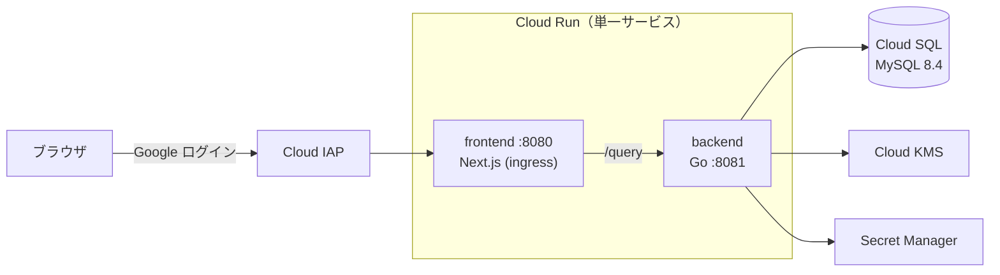

# KKB

単一ユーザーを前提とした、複式簿記ベースの家計簿アプリです。Google Cloud 上で運用しており、Terraform コードはプライベートリポジトリで管理しています。

[English README is here](./README.md)

## 動機

以前は既存の家計簿アプリを使用していましたが、画面構成をカスタマイズできず、自分が見たい数字を見やすい場所に表示できないなどの課題がありました。

そこで、Notionの家計簿テンプレートに移行しましたが、Notion上にデータベースを構築する仕組みのため、データ量が増えるにつれて動作が重くなるという問題がありました。

この 2 つは、実際の RDB を使い UI を自分で構築すれば解決できると考え、開発に着手しました。

初めて構築したのは、Cloudflare 上の Next.js × Hono.js による家計簿です。動くものは作れましたが、実際に使うこと・運用することを見越せておらず、使いづらいものになりました。一つには、どのような機能が必要か、どのように使うかを十分に見越して計画を立てられていなかったことが原因にあると考え、要件定義といったことを学びつつ、作り直すことを決断しました。
作り直しにあたっては、当時技術面でのスキル不足を感じていたこともあり、GCP・Go・Terraform を独習しながら現行版を構築しました。

## アーキテクチャ


```mermaid
flowchart LR
    B[ブラウザ] -->|Google ログイン| IAP[Cloud IAP]
    subgraph CR["Cloud Run（単一サービス）"]
        F["frontend :8080<br>Next.js (ingress)"]
        A["backend<br>Go :8081"]
        F -->|"/query"| A
    end
    IAP --> F
    A --> SQL[("Cloud SQL<br>MySQL 8.4")]
    A --> KMS[Cloud KMS]
    A --> SM[Secret Manager]
```

| レイヤー | 技術 |
|---|---|
| バックエンド | Go, gqlgen, ent (ORM), Atlas (マイグレーション) |
| フロントエンド | TypeScript, Next.js, React, Apollo Client |
| API | GraphQL (+ GraphQL Codegen) |
| DB | MySQL 8.4 (Cloud SQL) |
| クラウド | GCP: Cloud Run, Cloud SQL, KMS, Secret Manager, IAP |
| IaC | Terraform |
| CI/CD | GitHub Actions（lint・test、Workload Identity Federation によるタグ契機のデプロイ） |

### リポジトリ構成

| パス | 内容 |
|---|---|
| `go/` | バックエンド。gqlgen リゾルバ、ent スキーマ、internal パッケージ群（`aggregation`, `encryption`, `ledger_account`, `transaction`, `dataloader`, `serverenv` など） |
| `ts/` | フロントエンド。Next.js アプリ |
| `schema/` | バックエンドとフロントエンドの codegen が共有する GraphQL スキーマ |
| `containers/` | デプロイするイメージの Dockerfile 群 |
| `db/` | ローカル MySQL（Docker）関連ファイル |

インフラは Terraform で定義し、別のプライベートリポジトリで管理しています。

## 設計

### データモデル: 複式簿記

取引は、ヘッダーと、勘定科目に対して貸借が釣り合った仕訳明細の組で表現します。

| エンティティ | 役割 |
|---|---|
| `LedgerAccount` | 勘定科目。資産・負債・収益・費用 |
| `Transaction` | 取引ヘッダー。日付、メモ |
| `JournalEntry` | 仕訳明細。借方/貸方、金額 |
| `LedgerEncryptionKey` | 期間ごとのデータ暗号化キー（[暗号化](#暗号化-時間ベース-dek-によるエンベロープ暗号化) 参照） |

単純な支出と収入のモデルでは、電子マネーへのチャージなどの資産の移動や、負債を正確に表現しようとした時、複雑になってしまいます。あらゆるお金の動きに対応するために長年使用され、使用方法が共有されているモデルである、複式簿記を使用すれば、今後のユースケースの変化にも耐えうると考え、複式簿記をベースとしたモデルを構築しました。

### API: GraphQL

画面構成を自由に組み替えたいという課題に対して、GraphQL であれば並べ替えはフロントエンドだけの変更で完結し、エンドポイントの追加が不要になるであろうという理由から GraphQL を選択しています。`schema/` を元にサーバー側では gqlgen がコードを生成し、クライアント側では、Apollo Client と GraphQL Codegen が生成する構成です。

### データベース: MySQL 8.4

ワークロードはシングルユーザーによる単純な CRUD です。複雑な分析クエリはなく、同時並行性も実質ありません。この要件にはシンプルなMySQLで十分と判断しました。

### 永続化層: ent, Atlas

`go/ent/schema` のスキーマを情報源とし、 ent はここから完全に型付けされたクエリビルダを生成し、Atlas は同じ定義から SQL スキーマとマイグレーションを生成します。

画面ごとにフィルタや条件が変わるため、クエリを静的にコンパイルする **sqlc** は不採用としました。**GORM** は動的クエリを扱えますが、型安全性がありません。以上の理由から ent を採用しました。

### 認証: Cloud IAP に委譲する

Cloud Run サービスの前段に Cloud IAP を置き、Google ログインで認証しています。アプリ自身はユーザー・セッション・ユーザーテーブルを持ちません。

初めはアプリ層での認証を予定していましたが、エンベロープ暗号化と組み合わせた際に、当時の自分の知識では扱いきれない複雑さになりました。そこで、単一ユーザーであるため認証を IAP に委譲し、この領域を設計から外しました。

### 実行構成: 単一の Cloud Run サービス

Next.js を ingress コンテナとし、`/query` を rewrite で Go サイドカー（`127.0.0.1:8081`）へ渡しています。サービスは 1 つ、オリジンは 1 つで、ロードバランサーは使用していません。

最初は、LB + 2 サービス構成を検証していました。IAP の使用を検討した時点では、Cloud Run の前段に IAP を置くにはロードバランサーが必要でした。そのため、家計簿の実装に入る前にインフラを構築し、フロントエンドとバックエンドを別サービスにした状態で、この構成が機能することを確認しました。

その後、Cloud Run へ IAP を直接つけられる機能が Preview で利用可能になりました。LB を撤去すれば固定費を削減できるため、構成の見直しを行いました。

IAP の使用を調査する中で、IAP 付きサービスを 2 つに分けると、フロントエンドとバックエンドが別オリジンになるため、ブラウザからバックエンドへの通信がうまくいかないことがわかりました。というのも、IAP セッションクッキーはドメインごとに独立しており共有できないからです。

このような仕様を踏まえ、単一の Cloud Run サービスにまとめ、nginx を ingress コンテナとして `/` を Next.js サイドカーへ、`/query` を Go サイドカーへルーティングする構成を取りました。この構成は Raspberry Pi で Tailscale を使用しセルフホストしていた時の構成を引き継いだものです。

上記構成でしばらく運用していましたが、Next.js の rewrite オプションの存在を知りました。構成がシンプルになり、フロントエンドとバックエンド両方を前提としたアプリであることを踏まえ、Next.js を ingress コンテナとする構成に移行しました。

### 設定とシークレット: `secret://` リゾルバ

値が `secret://` で始まる環境変数だけを、起動時に Secret Manager から解決します。それ以外はそのまま読み込みます。

環境変数にシークレットを直接書き込むと、イメージや設定ファイルにシークレットが残るため、よくないと考えました。そのため、最初は、Secret Manager に一つの設定ファイルを保存し、それを起動時に読み込む戦略をとっていました。

しかし、この方法では、シークレットではない設定値も含め全設定を一つのファイルで管理することになるため、改善の余地がありました。いろいろ調査する中で、 [google/exposure-notifications-server](https://github.com/google/exposure-notifications-server) を見つけ、ここで採られている方式を採用しました。シークレットはイメージに残らず、非シークレットは普通の環境変数のまま、値ごとに個別に管理できる方法です。

### 暗号化: 時間ベース DEK によるエンベロープ暗号化

家計簿データはデータ暗号化キー（DEK）で暗号化し、その DEK を Cloud KMS でラップしています。1 つの DEK が 1 つの期間を担当します。

この仕組みは、IAP の背後にあるシングルユーザーのアプリには必要ありません。エンベロープ暗号化を実践で学ぶために実装しました。DEK の粒度はレコード単位・ユーザー単位・期間単位を比較し、期間単位を選びました。ローテーションがシンプルになり、ローカル開発・セルフホスト・GCP のいずれでも同じように動作するためです。実装は exposure-notifications-server の設計に倣っています。

## ローカル開発

### `direnv` と `go-task` を使う場合

- 必要なもの
    - direnv
    - docker
    - bun
    - [go-task/task](https://github.com/go-task/task/)
    - python

- 手順

```sh
direnv allow
mise trust & mise install # mise を使う場合
task init
task start:all
```

-> `http://localhost:3000/` を開く。

### 使わない場合

- 必要なもの
    - docker
    - bun（または Node.js）
    - python

- 手順

```sh
# 環境変数の設定
cp .env.example .env.local
source .env.local

# 初期化
mkdir -p ./db/docker/logs;
touch ./db/docker/logs/mysql-error.log;
touch ./db/docker/logs/mysql-slow.log;
touch ./db/docker/logs/mysql-query.log;
docker compose up -d
python go/tools/seed/data/generate_transactions.py
mkdir -p go/local/secrets
tr -dc A-Za-z0-9 </dev/urandom | head -c 16 >go/local/secrets/encryption_aad
docker compose exec api bash -c "go run ./tools/seed/"

# API サーバーをリロードして Next.js を起動
docker compose up -d api
cd ts
bun dev
```

## 参考リポジトリ

- [google/exposure-notifications-server](https://github.com/google/exposure-notifications-server): `secret://` 環境変数リゾルバ、時間ベース DEK によるエンベロープ暗号化の設計、サーバー環境のセットアップパターン
- [saki-engineering/graphql-sample](https://github.com/saki-engineering/graphql-sample): `gqlgen` の使用方法
