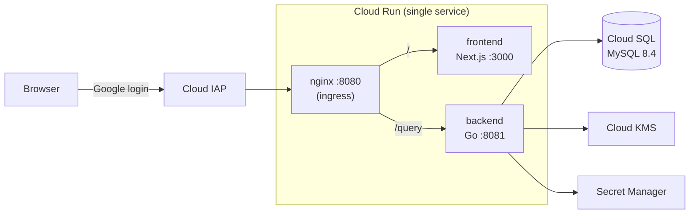

# KKB

A self-hosted, double-entry bookkeeping household budget app. Single-user, running on Google Cloud.

[日本語版 README はこちら](./README.ja.md)

## Motivation

I used to track my spending with a Notion template. It emulates a relational database on top of Notion, so it got slower and slower as records piled up. Existing budget apps were not an option either: their UIs are fixed, and I couldn't put the numbers I care about where I wanted them.

Since I can write code, both problems have the same root fix — use a real RDB and build the UI myself. The dashboard shows this week's / this month's / this year's spending first (at the very top on mobile), because keeping spending visible is the whole point of the app.

## Architecture



| Layer | Technology |
|---|---|
| Backend | Go, gqlgen, ent (ORM), Atlas (migration) |
| Frontend | TypeScript, Next.js, React, Apollo Client |
| API | GraphQL (+ GraphQL Codegen) |
| DB | MySQL 8.4 (Cloud SQL) |
| Cloud | GCP — Cloud Run, Cloud SQL, KMS, Secret Manager, IAP |
| IaC | Terraform |
| CI | GitHub Actions (lint, test) |

### Repository layout

| Path | Contents |
|---|---|
| `go/` | Backend — gqlgen resolvers, ent schema, internal packages (`aggregation`, `encryption`, `ledger_account`, `transaction`, `dataloader`, `serverenv`, …) |
| `ts/` | Frontend — Next.js app |
| `schema/` | GraphQL schema shared by backend and frontend codegen |
| `containers/` | Dockerfiles and the nginx ingress config |
| `db/` | Local MySQL (Docker) files |

Infrastructure is defined with Terraform and managed in a separate private repository.

## Design decisions

Why things are the way they are — including the options I rejected.

### Why double-entry bookkeeping

A simple income/expense ledger cannot represent my real money flows accurately. Charging a transit IC card is not an expense — it is a transfer between assets. Paying by credit card creates a liability first; the expense settles later. Double-entry bookkeeping models all of these with one uniform mechanism:

| Entity | Role |
|---|---|
| `LedgerAccount` | Accounts — assets, liabilities, income, expenses |
| `Transaction` | Transaction header — date, memo |
| `JournalEntry` | Journal lines — debit/credit, amount |
| `LedgerEncryptionKey` | Per-period data encryption key (see [encryption](#envelope-encryption-with-a-time-based-dek)) |

You don't need to know bookkeeping to use the app: dedicated input screens for expenses, income, and asset transfers generate the journal entries for you.

### Why GraphQL

I wanted to rearrange screens freely — the original complaint about existing apps. With GraphQL the client decides the shape of the data, so most UI changes touch only the frontend. gqlgen (schema-first, code-generated) on the server, Apollo Client + GraphQL Codegen on the client keep both ends type-safe from a single schema.

### Why MySQL

The workload is plain CRUD from a single user — no complex analytical queries, no concurrency to speak of. MySQL is simple and fast, and that is exactly what was needed; PostgreSQL's richer feature set had no use case here.

### Why ent (and Atlas)

- **sqlc** was rejected: queries are compiled statically, but the app needs dynamically composed SQL (filters and conditions assembled at runtime).
- **GORM** was rejected for its weak type safety.
- **ent** generates a fully typed query builder from a schema defined in Go, which covers dynamic queries without giving up type safety.
- **Atlas** integrates with ent — SQL schemas and migrations are generated from the ent schema, so there is a single source of truth.

### Why IAP instead of app-layer auth

This is a single-user app, so user management is pure overhead. I initially planned app-layer authentication, but combining it with envelope encryption — at the time the DEK was tied to the user — made the design more complex than my knowledge could handle. So I delegated authentication to Cloud IAP (Google login) and removed user features entirely.

In hindsight: after switching to a *time-based* DEK, app-layer auth would have been workable. The complexity came from tying encryption keys to users, not from auth itself.

### Why a single Cloud Run service with an nginx sidecar

The most reworked decision in the project:

1. **LB + two services (verified, never operated).** When I started, attaching IAP to Cloud Run required a load balancer in front. Before implementing the app, I built the infrastructure — an LB with separate frontend/backend Cloud Run services — and verified connectivity and DB access.
2. **IAP direct attach appears.** Around April 2025, attaching IAP directly to Cloud Run became available (Preview). Dropping the LB would remove its fixed cost (~$18/month even when idle), so I revisited the design.
3. **Design-stage research killed the two-service layout.** With two IAP-protected services, the backend lives on a different origin, and browser → backend requests fail on three fronts: IAP session cookies are per-domain and cannot be shared; CORS preflight (`OPTIONS`) carries no credentials, so IAP rejects it; and an unauthenticated AJAX call gets a 302/401 that `fetch` cannot complete. I avoided this by design rather than discovering it in production.
4. **Same origin fixes all three.** The final layout is one Cloud Run service: nginx as the ingress container, routing `/` to the Next.js sidecar and `/query` to the Go sidecar. One origin, one IAP session, no CORS. The LB is fully removed.

### Secrets: the `secret://` resolver

Two problems with naive secret handling: putting secrets directly in environment variables leaks them into images and configs, and my first fix — bundling all config (DB password, encryption AAD, allowed origins, …) into one file in Secret Manager — made values impossible to manage individually and stored non-secrets in Secret Manager for no reason.

I adopted the strategy used in [google/exposure-notifications-server](https://github.com/google/exposure-notifications-server): environment variables whose value starts with `secret://` are resolved from Secret Manager at startup; everything else is read as-is. Secrets stay out of images, non-secrets stay in plain env vars, and each value is managed on its own.

### Envelope encryption with a time-based DEK

Honestly: a single-user app behind IAP does not need this. I built it to learn how envelope encryption works in practice.

Ledger data is encrypted with a data encryption key (DEK), and the DEK itself is wrapped by Cloud KMS. For DEK granularity I considered per-record, per-user, and time-based keys, and chose time-based: it keeps rotation simple and works identically in local development, on the self-host setup, and on GCP. The implementation follows exposure-notifications-server's design.

## History

| Phase | Summary |
|---|---|
| Feb–Mar 2026 | Initial development (schema design, backend, frontend) |
| — | LB + two-service infrastructure built and verified ahead of implementation (never operated) |
| — | Self-hosted on a Raspberry Pi 5 with Tailscale (retired; the setup files were removed — see git history) |
| Now | Running on GCP with the single-service nginx-sidecar layout |


## Local development

### With `direnv` and `go-task`

- Requirements
    - direnv
    - docker
    - bun
    - [go-task/task](https://github.com/go-task/task/)
    - python

- Steps

```sh
direnv allow
mise trust # With mise
task init
task start:all
```

-> Open `http://localhost:3000/`.

### Without them

- Requirements
    - docker
    - bun (Or Node.js)
    - python

- Steps

```sh
# Configure env variables
cp .env.example .env.local
source .env.local

# Initialization
mkdir -p ./db/docker/logs;
touch ./db/docker/logs/mysql-error.log;
touch ./db/docker/logs/mysql-slow.log;
touch ./db/docker/logs/mysql-query.log;
docker compose up -d
python go/tools/seed/data/generate_transactions.py
mkdir -p go/local/secrets
tr -dc A-Za-z0-9 </dev/urandom | head -c 16 >go/local/secrets/encryption_aad
docker compose exec api bash -c "go run ./tools/seed/"

# Reload the api server and boot the Next.js
docker compose up -d api
cd ts
bun dev
```

## References

- [google/exposure-notifications-server](https://github.com/google/exposure-notifications-server) — the `secret://` env resolver, the time-based DEK envelope-encryption design, and the server-environment setup patterns
- [saki-engineering/graphql-sample](https://github.com/saki-engineering/graphql-sample)

