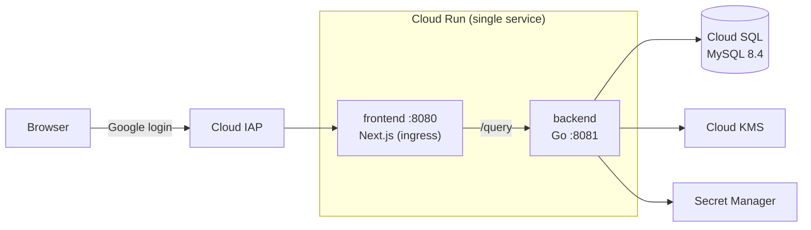

# KKB

A double-entry bookkeeping household budget app built for a single user. It runs on Google Cloud, and its Terraform code is managed in a separate private repository.

[日本語版 README はこちら](./README.ja.md)

## Motivation

I used to use an existing budget app, but I couldn't customize the screen layout, and I couldn't put the numbers I wanted to see where I could see them easily.

So I moved to a budget template in Notion, but because it builds a database on top of Notion, it got slower as the amount of data grew.

I figured both problems could be solved by using a real RDB and building the UI myself, so I started development.

The first version I built was a budget app on Cloudflare, using Next.js and Hono.js. I got something working, but I hadn't thought through actually using and operating it day to day, so it ended up awkward to use. One cause, I concluded, was that I hadn't planned well enough for what features I'd need or how I'd use them, so I decided to rebuild it while learning things like requirements definition.
For the rebuild, I also felt I lacked technical skills at the time, so I built the current version while teaching myself GCP, Go, and Terraform.

## Architecture


```mermaid
flowchart LR
    B[Browser] -->|Google login| IAP[Cloud IAP]
    subgraph CR["Cloud Run (single service)"]
        F["frontend :8080<br>Next.js (ingress)"]
        A["backend<br>Go :8081"]
        F -->|"/query"| A
    end
    IAP --> F
    A --> SQL[("Cloud SQL<br>MySQL 8.4")]
    A --> KMS[Cloud KMS]
    A --> SM[Secret Manager]
```

| Layer | Technology |
|---|---|
| Backend | Go, gqlgen, ent (ORM), Atlas (migration) |
| Frontend | TypeScript, Next.js, React, Apollo Client |
| API | GraphQL (+ GraphQL Codegen) |
| DB | MySQL 8.4 (Cloud SQL) |
| Cloud | GCP: Cloud Run, Cloud SQL, KMS, Secret Manager, IAP |
| IaC | Terraform |
| CI/CD | GitHub Actions (lint, test; tag-triggered deploy via Workload Identity Federation) |

### Repository layout

| Path | Contents |
|---|---|
| `go/` | Backend. gqlgen resolvers, the ent schema, and internal packages (`aggregation`, `encryption`, `ledger_account`, `transaction`, `dataloader`, `serverenv` and others) |
| `ts/` | Frontend. The Next.js app |
| `schema/` | The GraphQL schema, shared by backend and frontend codegen |
| `containers/` | Dockerfiles for the deployed images |
| `db/` | Local MySQL (Docker) files |

Infrastructure is defined with Terraform and managed in a separate private repository.

## Design

### Data model: double-entry bookkeeping

A transaction is represented as a header plus a set of journal lines, posted to accounts, where debits and credits balance.

| Entity | Role |
|---|---|
| `LedgerAccount` | An account: asset, liability, income or expense |
| `Transaction` | Transaction header: date and memo |
| `JournalEntry` | A journal line: debit or credit, and an amount |
| `LedgerEncryptionKey` | The data encryption key for each period (see [Encryption](#encryption-envelope-encryption-with-a-time-based-dek)) |

A simple income-and-expense model gets complicated when you try to accurately represent things like asset transfers, such as charging an e-money card, or liabilities. Double-entry bookkeeping is a model that has been used for a long time to handle every kind of money movement, and its conventions are widely shared. I judged that using it would hold up against future changes in use cases, so I built the model on top of double-entry bookkeeping.

### API: GraphQL

For the problem of wanting to freely rearrange the screen layout, I chose GraphQL because, with it, rearranging is a frontend-only change and needs no new endpoint. Based on `schema/`, gqlgen generates code on the server side, and Apollo Client and GraphQL Codegen generate it on the client side.

### Database: MySQL 8.4

The workload is simple CRUD by a single user. There are no complex analytical queries, and there's effectively no concurrency. I judged that simple MySQL is sufficient for these requirements.

### Persistence: ent, Atlas

Using the schema in `go/ent/schema` as the source, ent generates a fully typed query builder from it, and Atlas generates the SQL schema and migrations from the same definitions.

Because filters and conditions change per screen, I ruled out **sqlc**, which compiles queries statically. **GORM** can handle dynamic queries, but it gives up type safety. For these reasons, I adopted ent.

### Authentication: delegated to Cloud IAP

I put Cloud IAP in front of the Cloud Run service and authenticate with Google login. The app itself has no users, sessions, or user table.

I originally planned to handle authentication at the app layer, but combined with envelope encryption, it became a complexity beyond what I could handle with my knowledge at the time. So, since it's a single-user app, I delegated authentication to IAP and removed this area from the design.

### Runtime: one Cloud Run service

Next.js is the ingress container, and it passes `/query` to the Go sidecar (`127.0.0.1:8081`) via a rewrite. There is one service, one origin, and no load balancer.

At first, I verified an LB-plus-two-services setup. When I was considering using IAP, putting IAP in front of Cloud Run required a load balancer. So before starting on the budget app's implementation itself, I built that infrastructure, with the frontend and backend as separate services, and confirmed that the setup worked.

Later, the ability to attach IAP directly to Cloud Run became available in Preview. Removing the LB would cut fixed costs, so I revisited the setup.

While researching how to use IAP, I found that splitting an IAP-protected service into two would put the frontend and backend on different origins, which would break communication from the browser to the backend. That's because IAP session cookies are per domain and can't be shared.

Given this behavior, I consolidated into a single Cloud Run service, using nginx as the ingress container to route `/` to the Next.js sidecar and `/query` to the Go sidecar. This setup carried over from when I was self-hosting on a Raspberry Pi with Tailscale.

I ran that setup for a while, but then learned about Next.js's rewrite option. It would simplify the setup, and given that the app assumes both a frontend and a backend anyway, I migrated to a setup with Next.js as the ingress container.

### Configuration and secrets: the `secret://` resolver

Only environment variables whose value starts with `secret://` are resolved from Secret Manager at startup. Everything else is loaded as-is.

Writing secrets directly into environment variables leaves them in images and config files, which I considered a bad idea. So at first, I took the approach of storing a single configuration file in Secret Manager and loading it at startup.

But that approach meant managing every setting, including non-secret ones, in a single file, which left room for improvement. While researching this, I found [google/exposure-notifications-server](https://github.com/google/exposure-notifications-server) and adopted the approach it uses: secrets never end up in the image, non-secrets stay as ordinary environment variables, and every value can be managed individually.

### Encryption: envelope encryption with a time-based DEK

Ledger data is encrypted with a data encryption key (DEK), and that DEK is wrapped by Cloud KMS. One DEK covers one period.

This mechanism isn't necessary for a single-user app behind IAP. I implemented it to learn envelope encryption hands-on. I compared per-record, per-user, and per-period granularity for the DEK and chose per-period, because it keeps rotation simple and behaves the same in local development, self-hosting, and on GCP. The implementation follows the design used by exposure-notifications-server.

## Local development

### With `direnv` and `go-task`

- Requirements
    - direnv
    - docker
    - bun
    - [go-task/task](https://github.com/go-task/task/)
    - python

- Steps

```sh
direnv allow
mise trust && mise install # With mise
task init
task start:all
```

-> Open `http://localhost:3000/`.

### Without them

- Requirements
    - docker
    - bun (Or Node.js)
    - python

- Steps

```sh
# Configure env variables
cp .env.example .env.local
source .env.local

# Initialization
mkdir -p ./db/docker/logs;
touch ./db/docker/logs/mysql-error.log;
touch ./db/docker/logs/mysql-slow.log;
touch ./db/docker/logs/mysql-query.log;
docker compose up -d
python go/tools/seed/data/generate_transactions.py
mkdir -p go/local/secrets
tr -dc A-Za-z0-9 </dev/urandom | head -c 16 >go/local/secrets/encryption_aad
docker compose exec api bash -c "go run ./tools/seed/"

# Reload the api server and boot the Next.js
docker compose up -d api
cd ts
bun dev
```

## References

- [google/exposure-notifications-server](https://github.com/google/exposure-notifications-server): the `secret://` env resolver, the time-based DEK envelope-encryption design, and the server-environment setup patterns
- [saki-engineering/graphql-sample](https://github.com/saki-engineering/graphql-sample): how to use `gqlgen`
